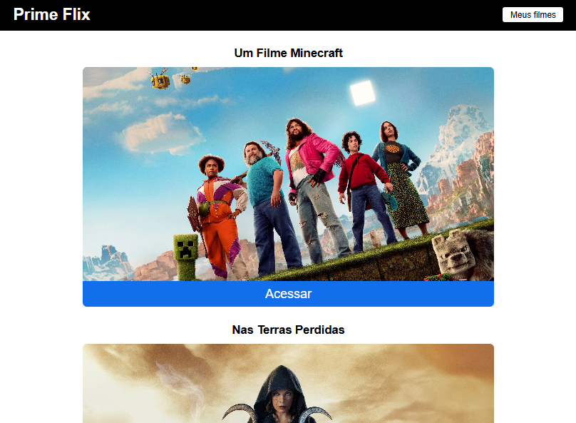
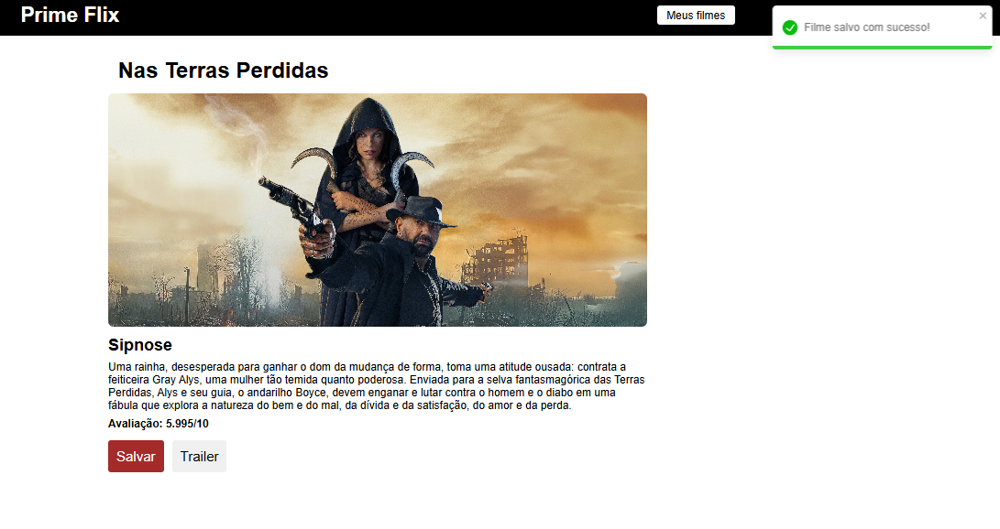
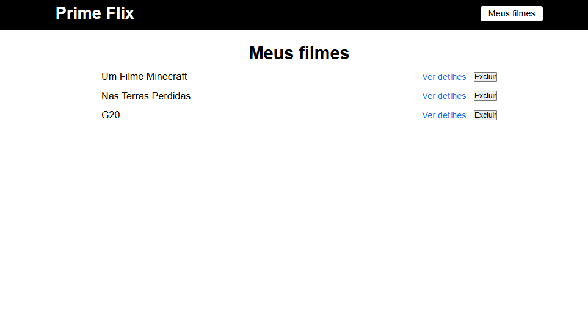

# PrimeFLIX

É um aplicativo criado como projeto de aprendizado para praticar React JS. Ele consome a API do IMDB para exibir os **10 filmes mais populares do momento**, com funcionalidades interativas como:

- Visualização de sinopse e avaliação dos filmes
- Acesso rápido ao trailer (via YouTube)
- Marcar e desmarcar filmes como favoritos

---

## 🖼️ Preview

### Tela Home


### Tela de Detalhes do Filme


### Tela Lista de Filmes Favoritos


---

## ✨ Funcionalidades

- 🔝 Listagem dos **10 filmes mais populares**
- 🎬 Visualização de **detalhes completos** do filme:
  - Sinopse
  - Avaliação
- ⭐ Adicionar e remover filmes da sua **lista de favoritos**
- ▶️ Botão para **assistir ao trailer no YouTube**
- 💾 Lista de favoritos salva no localStorage (permanece mesmo após recarregar)

---

## 🛠️ Tecnologias utilizadas

- **React** – para construir a interface
- **Axios** – para chamadas à API
- **React Router** – para navegação entre páginas
- **CSS**
- **API IMDB**

---

## 🚀 Como rodar localmente

```bash
# Clone o repositório
git clone https://github.com/HadassaKiria/primeflix.git

# Acesse a pasta
cd primeflix

# Instale as dependências
npm install

# Crie um arquivo .env com a sua API_KEY
Na raiz do projeto crie um arquivo .env e adicione REACT_APP_API_KEY=SuaApiKey

# Inicie o projeto
npm run dev
